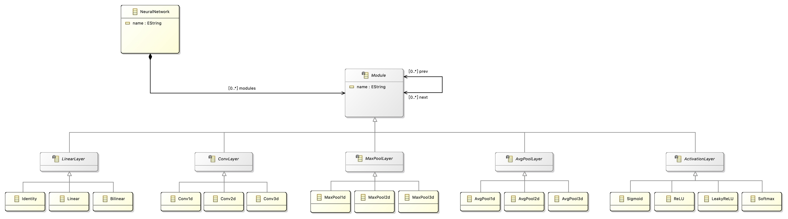
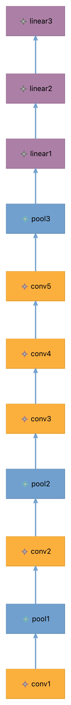

### 元模型截图

### 元模型含义说明

#### Classifier

|      名称       |                含义                |
| :-------------: | :--------------------------------: |
|  NeuralNetwork  |          一个前馈神经网络          |
|     Module      |        神经网络中的一个模块        |
|   LinearLayer   |               线性层               |
|    Identity     | 不对输入做任何变换，输出与输入相同 |
|     Linear      |              线性变换              |
|    Bilinear     |             双线性变换             |
|    ConvLayer    |               卷积层               |
|     Conv1d      |             一维卷积层             |
|     Conv2d      |             二维卷积层             |
|     Conv3d      |             三维卷积层             |
|  MaxPoolLayer   |             最大池化层             |
|    MaxPool1d    |           一维最大池化层           |
|    MaxPool2d    |           二维最大池化层           |
|    MaxPool3d    |           三维最大池化层           |
|  AvgPoolLayer   |             平均池化层             |
|    AvgPool1d    |           一维平均池化层           |
|    AvgPool2d    |           二维平均池化层           |
|    AvgPool3d    |           三维平均池化层           |
| ActivationLayer |             激活函数层             |
|     Sigmoid     |          Sigmoid 激活函数          |
|      ReLU       |           ReLU 激活函数            |
|    LeakyReLU    |         LeakyReLU 激活函数         |
|     Softmax     |          Softmax 激活函数          |

#### Association

|  名称   |           含义           |
| :-----: | :----------------------: |
| modules | 每个神经网络有若干个模块 |
|  prev   | 每个模块有若干个前置模块 |
|  next   | 每个模块有若干个后置模块 |
|         |     其他都是继承关系     |

### 图形建模截图

选取了经典网络 AlexNet 进行建模，包含 5 个卷积层、3 个最大池化层、3 个全连接层。

### 元模型与图形建模语言映射关系说明

#### Classifier

|  元模型   |    图形语言    |
| :-------: | :------------: |
| Identity  |   浅蓝色矩形   |
|  Linear   |    紫色矩形    |
| Bilinear  |   浅灰色矩形   |
|  Conv1d   |   浅绿色矩形   |
|  Conv2d   |    橙色矩形    |
|  Conv3d   |   浅紫色矩形   |
| MaxPool1d |   浅红色矩形   |
| MaxPool2d |    蓝色矩形    |
| MaxPool3d |   深蓝色矩形   |
| AvgPool1d | 深巧克力色矩形 |
| AvgPool2d |   深灰色矩形   |
| AvgPool3d |   深绿色矩形   |
|  Sigmoid  |   深橙色矩形   |
|   ReLU    |   深紫色矩形   |
| LeakyReLU |   深红色矩形   |
|  Softmax  |   深黄色矩形   |

#### Association

| 元模型 |   图像语言   |
| :----: | :----------: |
|  next  | 蓝色实线箭头 |

