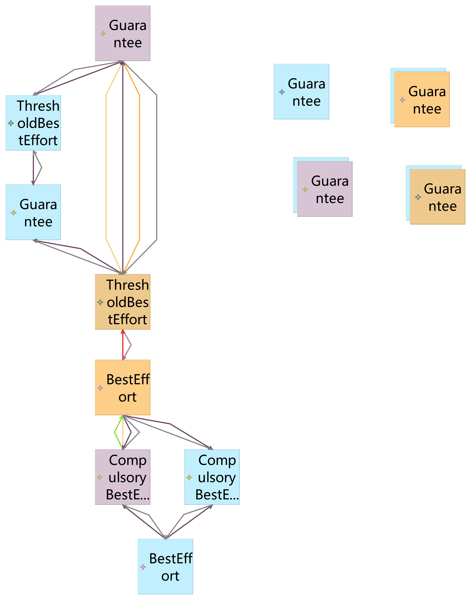

# **QoS Metamodel Introduction**

# 

1. *QoSCharacteristic：QoSCharacteristics represents quantifiable characteristics of services.* 

2. *QoSDimension: QoSDimensions are dimensions for the quantification of QoSCharacteristics.* 

3. *QoSCategory: When the number of QoSCharacteristics is large, or they are especially complex, some mechanisms for grouping are required.* 

4. *QoSParameter: The description of generic characteristics may require, for example, the parameterization of the units and types for the description of value definitions, or some specific methods for the quantification of the values; QoSParameter supports these parameters.*

5. *QoSValue: QoSValues are instances of QoSCharacteristics that have resolved all their parameters* 

6. *QoSDimensionSlot: QoSDimensionSlot: QoSDimensionSlot represents the value of a primitive QoSDimension or a reference to another QoSValue.* 

7. *QoSConstraint: The QoSConstraints define any kind of restriction that QASF and RCC impose on QoScharacteristics.*

8. *QoSContext: Often, quality constraints and expressions have more than one QoSCharacteristic associated. Sometimes, these expressions and constraints combine functional elements and non-functional elements. QoSContext allows describing the context of quality expression when it includes multiple QoSCharacteristics and model elements.* 

9. *QoSRequired: when a client defines its Required QoSconstraint, the provider (software element or a resource) that supports the service must provide services with some quality levels to achieve its clients’ requirements.* 

10. *QoSOffered: The specification of software components includes the description of their interfaces. The interfaces include the set of services provided.* 

11. *QoSContract: The quality provider specifies the quality values it can support (provider- Offered QoS) and the requirements that must achieve its clients (provider-Required QoS).* 

12. *QoSCompoundConstraint: QoSCompoundConstraint is the combination of a set of constraints that ensemble represent a QoSConstraint for the model element (e.g., class, component, or object).*

13. *QoSLevel: QoSLevel represents the different modes of QoS that a subsystem can support.* 

14. *QoSTransition: QoSTransition models the allowed transitions between QoS Levels.* 

15. *QoSCompoundLevel:A QoSCompoundLevel includes all the QoSLevels that define the quality behavior of a model element.* 

    

