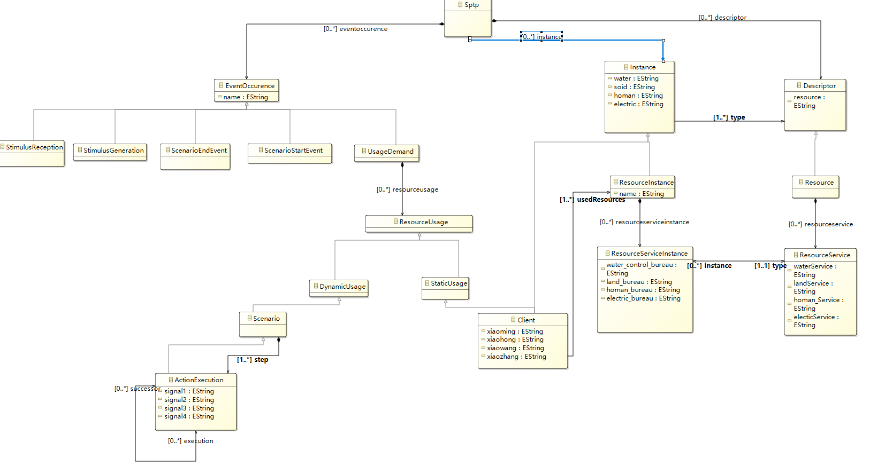
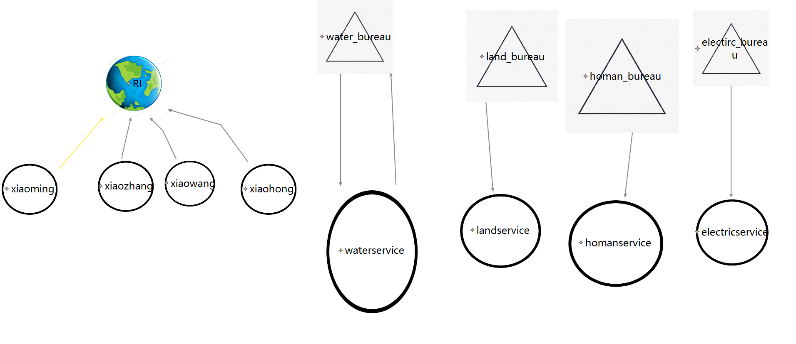

（a）元模型截图

（b）元模型含义

Instance and Descriptor：The dashed-line dependencies between the top-level association connecting Instance and Descriptor and the lower associations are meant to convey that the latter are specializations of the former.

resource instance：A *resource instance* represents a run-time entity that offers one or more *services* for which we need to express a measure of effectiveness or quality of service (QoS). 

resource service instance：A *resource service instance* is a specific incarnation of a resource service description that is provided by a specific resource instance. 

*stimulus generation* and *stimulus reception*：A stimulus generation event occurs when an object executes an action that invokes an operation on another object (the *receiver*) or sends a signal to it. The effect of the stimulus generation event is the creation and dispatching of a stimulus that identifies the parameters of the communication (the operation invoked, the values of the parameters, etc.). 

*scenario start event* and *scenario end event* ：In addition to the stimulus generation and stimulus reception events, in a number of analyses it is also useful to consider the events that occur when a scenario starts and ends its execution (*scenario start event* and *scenario end event* respectively).

client：This model is used in cases where the relationship between the clients and resources can be viewed as static. This does not necessarily mean that it is static, but simply that the dynamics of usage are not relevant to the model analysis on hand. The domain model in this case includes an explicit *client*, which is also a kind of instance. In this case, however, the notion of resource services is not required. 

（c）

(d)图形语言映射是从元模型中找出了client和ResourceInstance的几个实例然后进行关系整理，然后找了四个ResourceInstanceService和四个ResourceService的实例以及他们的对应关系进行的整理。