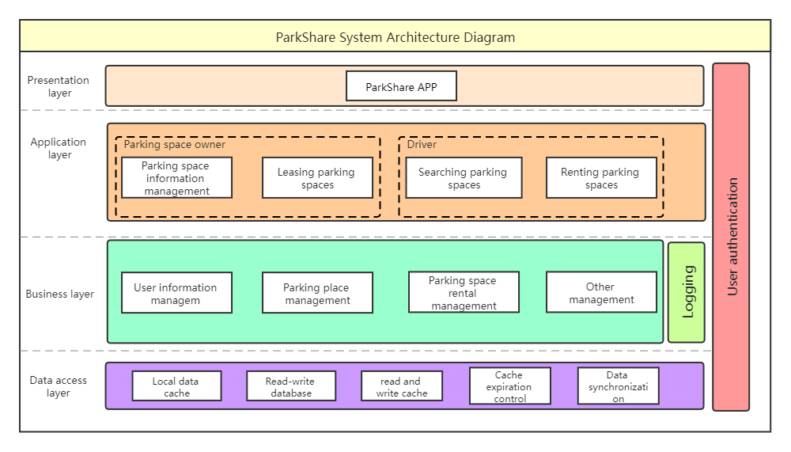
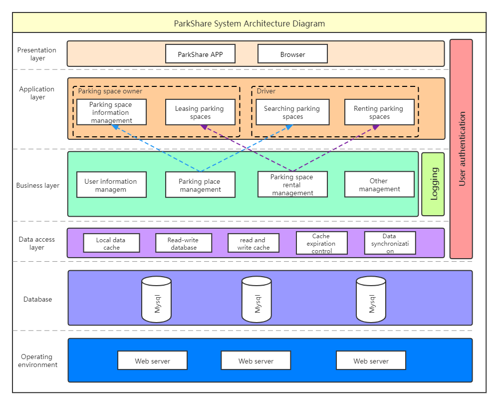
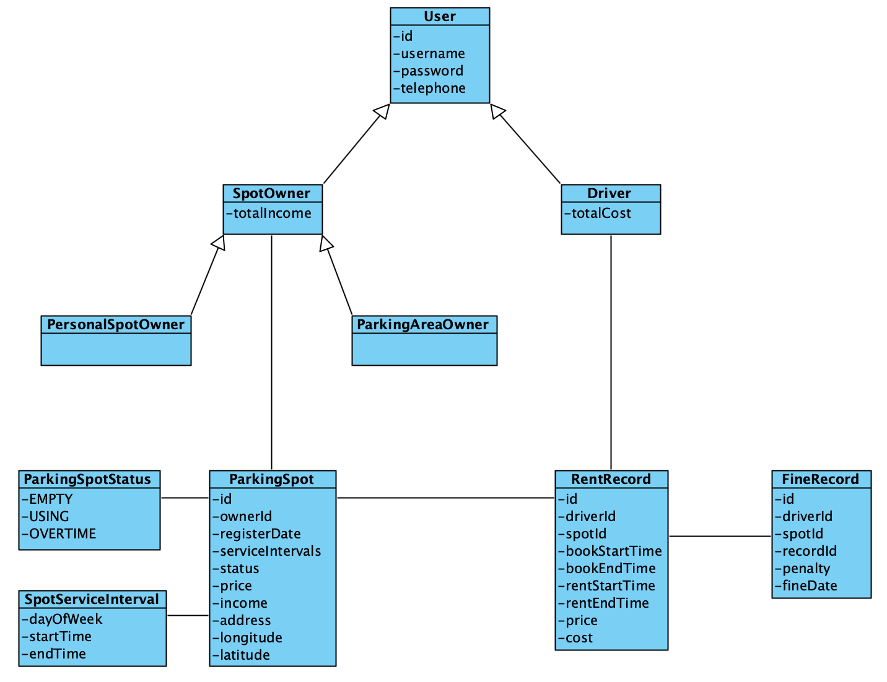
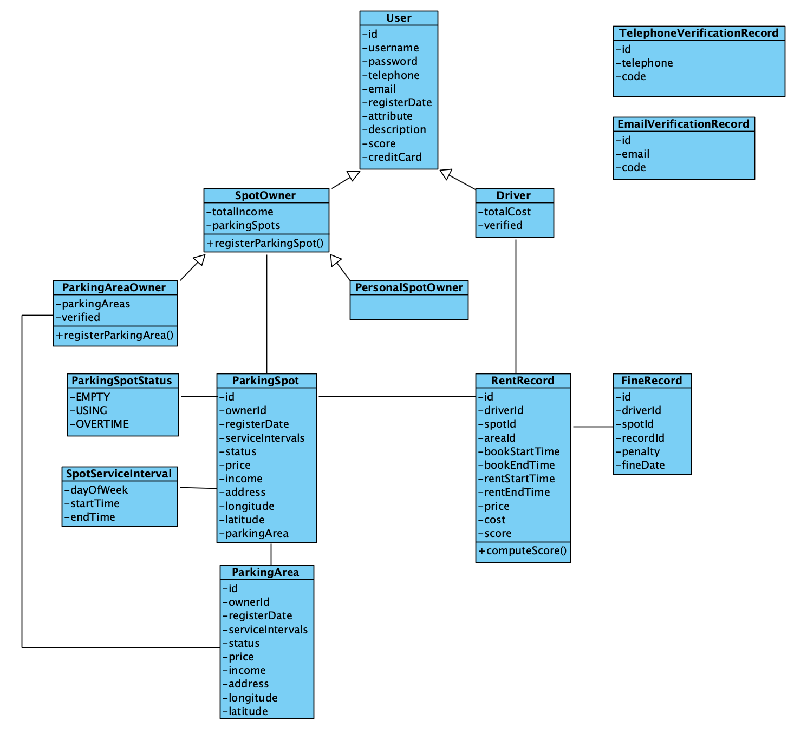

### 架构截图与说明

#### Versoin 1

本系统采用多层架构（Multitier architecture），包括了

- **Presentation layer** 
- **Application layer**
- **Business layer** 
- **Data access layer**

Presentation layer 是用户操作界面

Application layer涵盖了系统的功能，实现了各个用例的需求

Business layer实现Application layer的功能，对用户操作进行记录，并保存到数据库中

Data access layer包括了数据的存储

每个层级都需要用户的认证信息。

#### Versoin 2

| 更新说明                         |
| -------------------------------- |
| 增加Web端应用                    |
| 增加业务逻辑层和应用层之间的联系 |
| 增加数据库                       |
| 增加运行环境                     |

### 类图截图与说明

#### Versoin 1

|         类          |                             说明                             |
| :-----------------: | :----------------------------------------------------------: |
|        User         |       表示使用该系统的用户，拥有用户名、密码等基础属性       |
|      SpotOwner      | 表示在系统中出租停车位的用户，抽象了个人出租者和停车场所有者的公共属性和行为 |
|  PersonalSpotOwner  |                     表示个人停车位出租者                     |
|  ParkingAreaOwner   |          表示停车场所有者，往往出租集中的大量停车位          |
|     ParkingSpot     | 表示注册的一个停车位，拥有所有者 ID、注册时间、服务时间等属性 |
|  ParkingSpotStatus  |           表示停车位的当前状态：空闲、使用中、超时           |
| SpotServiceInterval |   表示停车位的一个服务间隔，包括：周几、几点开始、几点结束   |
|     RentRecord      |  表示一次租用记录，拥有司机 ID、车位 ID、预定开始时间等属性  |
|     FineRecord      |     表示一次超时处罚记录，每条处罚记录对应于一条租用记录     |

#### Version 2

|             类              |                             说明                             |
| :-------------------------: | :----------------------------------------------------------: |
|            User             |       表示使用该系统的用户，拥有用户名、密码等基础属性       |
|          SpotOwner          | 表示在系统中出租停车位的用户，抽象了个人出租者和停车场所有者的公共属性和行为 |
|           Driver            |                     表示租用停车位的司机                     |
|      PersonalSpotOwner      |                     表示个人停车位出租者                     |
|      ParkingAreaOwner       |          表示停车场所有者，往往出租集中的大量停车位          |
|         ParkingSpot         | 表示注册的一个停车位，拥有所有者 ID、注册时间、服务时间等属性 |
|         ParkingArea         |         表示注册的一个停车场，可以一次注册整个停车场         |
|      ParkingSpotStatus      |           表示停车位的当前状态：空闲、使用中、超时           |
|     SpotServiceInterval     |   表示停车位的一个服务间隔，包括：周几、几点开始、几点结束   |
|         RentRecord          |  表示一次租用记录，拥有司机 ID、车位 ID、预定开始时间等属性  |
|         FineRecord          |     表示一次超时处罚记录，每条处罚记录对应于一条租用记录     |
| TelephoneVerificationRecord |       验证电话号码的记录，包括每次验证的手机号的验证码       |
|   EmailVerificationRecord   |      验证电子邮箱的记录，包括每次验证的邮箱地址和验证码      |

### 系统顺序图截图与说明

- searchParkingSpot 顺序图

- register 顺序图

- login 顺序图

- ShowAssetsService 顺序图

### 选用 Architectural Pattern 的理由和具体情况

### 选用 Design Pattern 的理由和具体情况

