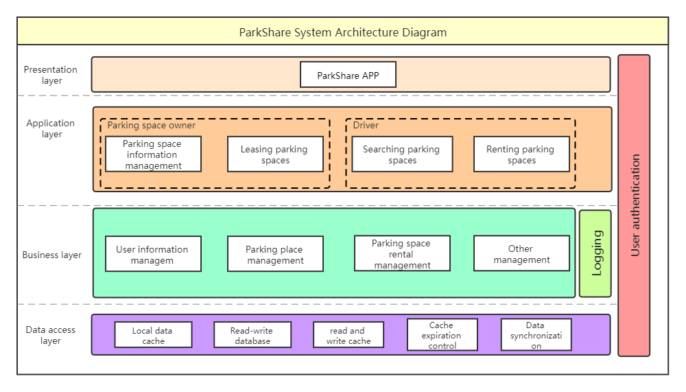
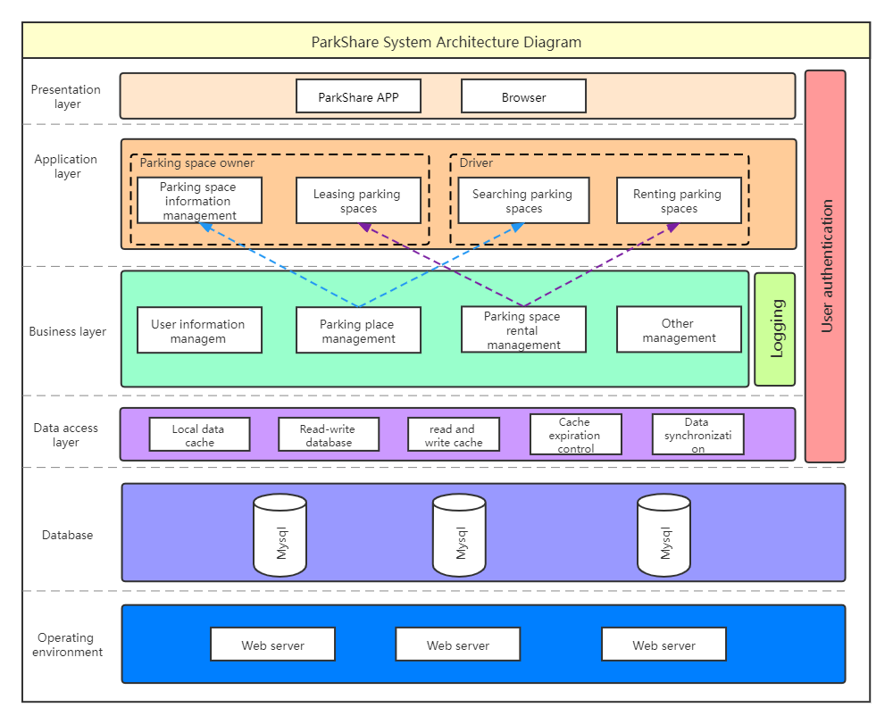
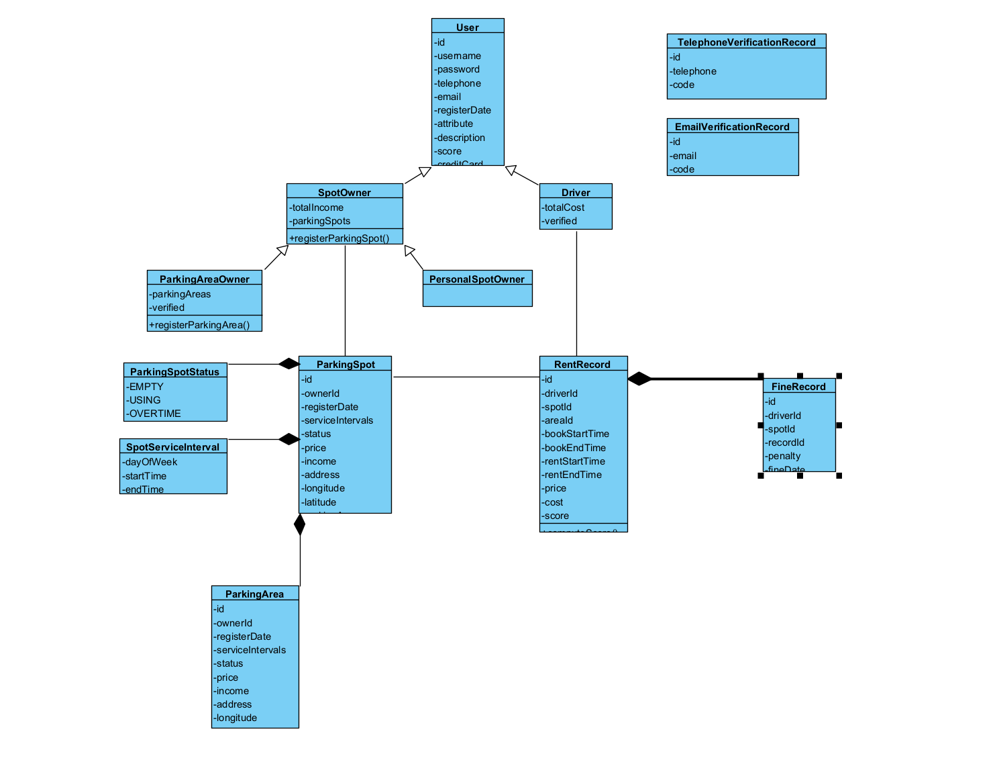
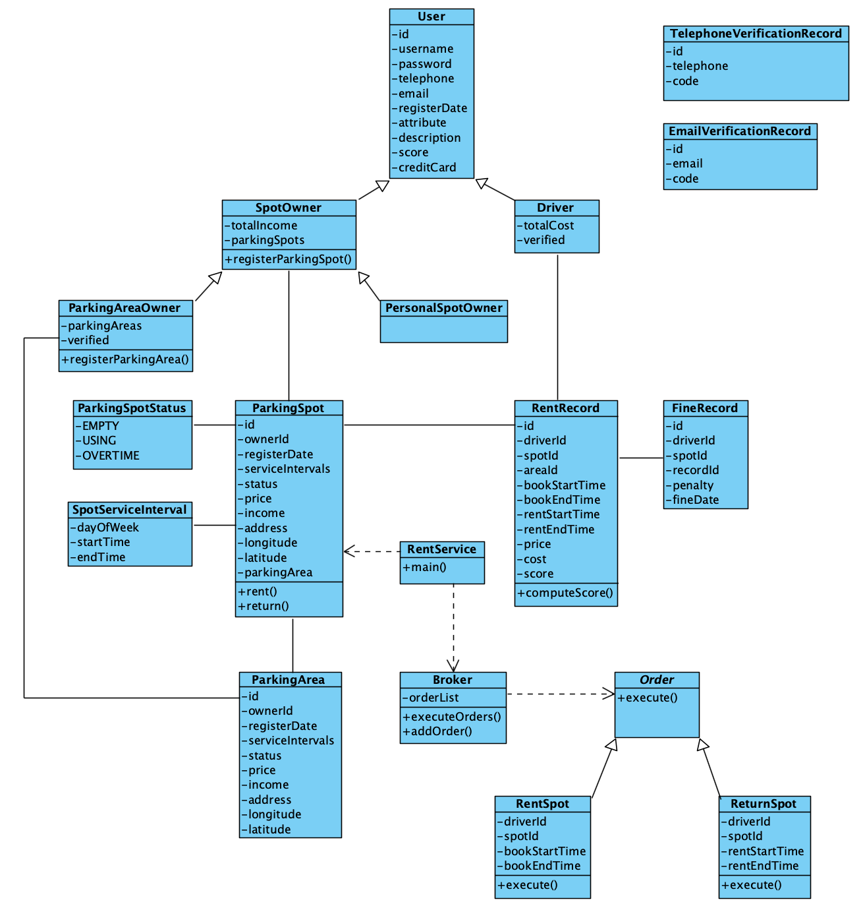
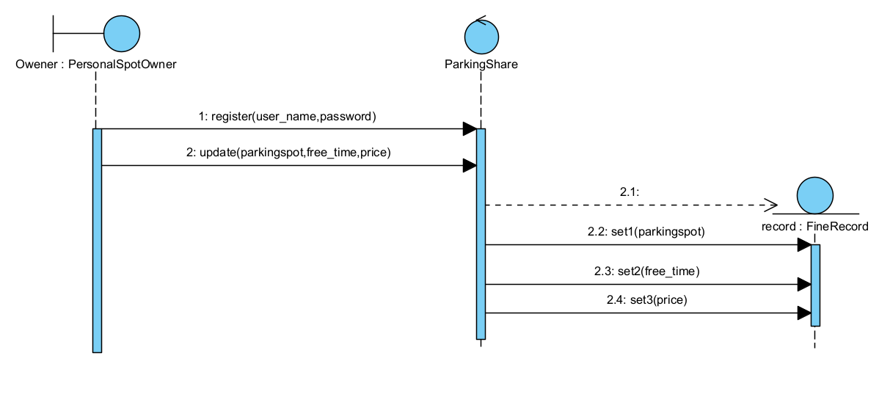
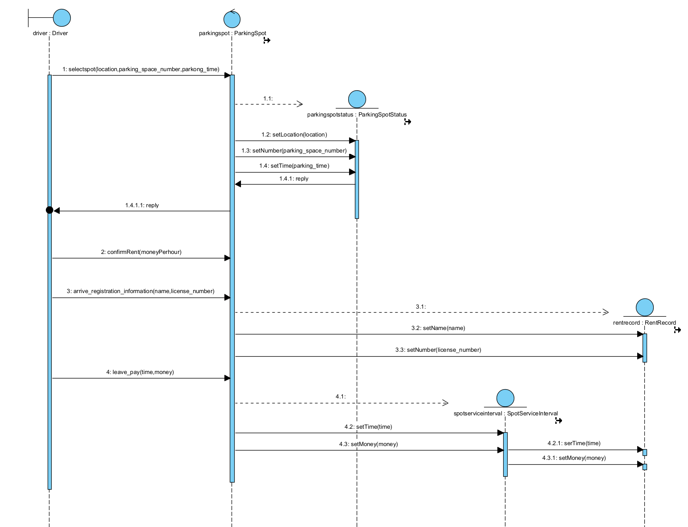
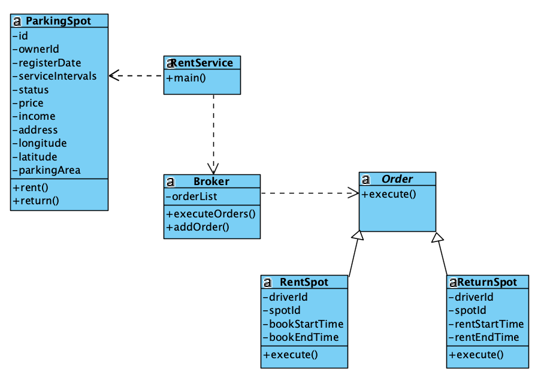

### 架构截图与说明

#### Version 1

本系统采用多层架构（Multitier architecture），包括了

- **Presentation layer** 
- **Application layer**
- **Business layer** 
- **Data access layer**

Presentation layer 是用户操作界面

Application layer涵盖了系统的功能，实现了各个用例的需求

Business layer实现Application layer的功能，对用户操作进行记录，并保存到数据库中

Data access layer包括了数据的存储

每个层级都需要用户的认证信息。

#### Version 2

| 更新说明                         |
| -------------------------------- |
| 增加Web端应用                    |
| 增加业务逻辑层和应用层之间的联系 |
| 增加数据库                       |
| 增加运行环境                     |

### 类图截图与说明

#### Versoin 1

|         类          |                             说明                             |
| :-----------------: | :----------------------------------------------------------: |
|        User         |       表示使用该系统的用户，拥有用户名、密码等基础属性       |
|      SpotOwner      | 表示在系统中出租停车位的用户，抽象了个人出租者和停车场所有者的公共属性和行为 |
|  PersonalSpotOwner  |                     表示个人停车位出租者                     |
|  ParkingAreaOwner   |          表示停车场所有者，往往出租集中的大量停车位          |
|     ParkingSpot     | 表示注册的一个停车位，拥有所有者 ID、注册时间、服务时间等属性 |
|  ParkingSpotStatus  |           表示停车位的当前状态：空闲、使用中、超时           |
| SpotServiceInterval |   表示停车位的一个服务间隔，包括：周几、几点开始、几点结束   |
|     RentRecord      |  表示一次租用记录，拥有司机 ID、车位 ID、预定开始时间等属性  |
|     FineRecord      |     表示一次超时处罚记录，每条处罚记录对应于一条租用记录     |

#### Version 2

|             类              |                             说明                             |
| :-------------------------: | :----------------------------------------------------------: |
|            User             |       表示使用该系统的用户，拥有用户名、密码等基础属性       |
|          SpotOwner          | 表示在系统中出租停车位的用户，抽象了个人出租者和停车场所有者的公共属性和行为 |
|           Driver            |                     表示租用停车位的司机                     |
|      PersonalSpotOwner      |                     表示个人停车位出租者                     |
|      ParkingAreaOwner       |          表示停车场所有者，往往出租集中的大量停车位          |
|         ParkingSpot         | 表示注册的一个停车位，拥有所有者 ID、注册时间、服务时间等属性 |
|         ParkingArea         |         表示注册的一个停车场，可以一次注册整个停车场         |
|      ParkingSpotStatus      |           表示停车位的当前状态：空闲、使用中、超时           |
|     SpotServiceInterval     |   表示停车位的一个服务间隔，包括：周几、几点开始、几点结束   |
|         RentRecord          |  表示一次租用记录，拥有司机 ID、车位 ID、预定开始时间等属性  |
|         FineRecord          |     表示一次超时处罚记录，每条处罚记录对应于一条租用记录     |
| TelephoneVerificationRecord |       验证电话号码的记录，包括每次验证的手机号的验证码       |
|   EmailVerificationRecord   |      验证电子邮箱的记录，包括每次验证的邮箱地址和验证码      |

#### Version 3.1

这张图是用建造者模式（Builder Pattern）对类图进行的优化。

#### Version 3.2

|     类      |                   说明                   |
| :---------: | :--------------------------------------: |
| RentService |    命令模式中的 Client，负责使用命令     |
|   Broker    | 命令模式中的 Invoker，负责保存和执行命令 |
|    Order    |        命令抽象类，所有命令的父类        |
|  RentSpot   |             租用停车位的命令             |
| ReturnSpot  |             归还停车位的命令             |
| ParkingSpot | 命令模式中的 Receiver，负责真正执行命令  |

### 系统顺序图截图与说明

- searchParkingSpot 顺序图

- register 顺序图

#### Version 1

#### Version 2

- login 顺序图

- ShowParkingSpotStatus 顺序图
  

- RentFromOwener顺序图

  

- RentToDriver顺序图

  

### 选用 Architectural Pattern 的理由和具体情况

### 选用 Design Pattern 的理由和具体情况

#### 抽象工厂模式

version2的register选用了**抽象工厂模式**，抽象工厂模式除了具有工厂方法模式的优点外，最主要的优点就是可以在类的内部对产品族进行约束。所谓的产品族，一般或多或少的都存在一定的关联，抽象工厂模式就可以在类内部对产品族的关联关系进行定义和描述，而不必专门引入一个新的类来进行管理。本系统的用户存在继承情况，并且后续开发可能会出现多级继承的结构，分属各个等级结构中的实现类之间存在着一定的关联或者约束，故使用抽象工厂模式进行系统类创建的优化。

#### 建造者模式

类图的version3选用的是建造者模式（Builder Pattern），它主要解决在软件系统中，有时候面临着"一个复杂对象"的创建工作，其通常由各个部分的子对象用一定的算法构成；由于需求的变化，这个复杂对象的各个部分经常面临着剧烈的变化，但是将它们组合在一起的算法却相对稳定。它有两方面的优点： 1、建造者独立，易扩展。 2、便于控制细节风险
所以选择建造者模式（Builder Pattern）对系统类图进行优化

#### 命令模式

类图的 Version 3 新增了**命令模式** (Command Pattern)，将每次租用和归还停车位抽象为命令，降低了命令发出者 (Driver) 与命令执行者 (ParkingSpot) 之间的耦合，后续还可以对租用和归还停车位的操作定制参数，支持更丰富的业务场景，并且能够更方便地实现撤销 (Undo) 和重做 (Redo) 操作。

