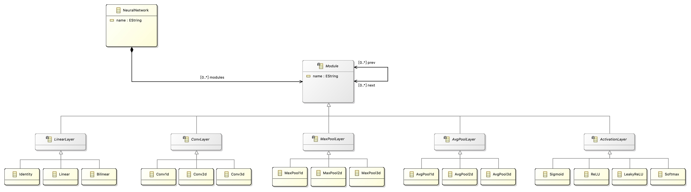
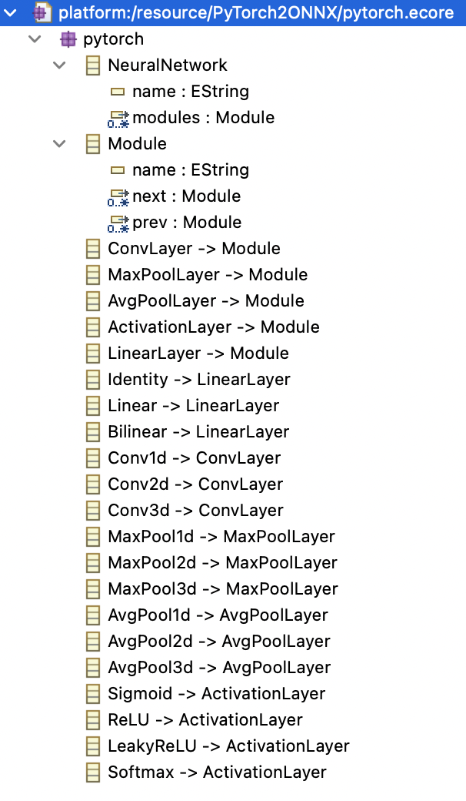
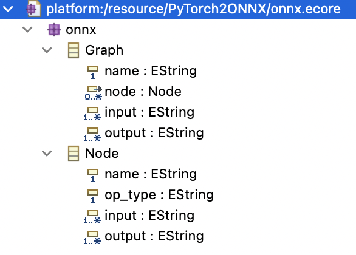

### 输入元模型

简化的 PyTorch 卷积神经网络模型





### 输出元模型

简化的 [ONNX 模型](https://github.com/onnx/onnx/blob/master/docs/IR.md) (裁剪了与输入元模型对应的部分)



#### Graph

| Name   | Type     | Description                                                  |
| ------ | -------- | ------------------------------------------------------------ |
| name   | string   | The name of the model graph.                                 |
| node   | Node[]   | A list of nodes, forming a partially ordered computation graph based on input/output data dependencies. It is in topological order. |
| input  | string[] | The input parameters of the graph.                           |
| output | string[] | The output parameters of the graph. Once all output parameters have been written to by a graph execution, the execution is complete. |

#### Node

|Name|Type|Description|
|---|---|---|
|name|string|An optional name of the node, used for diagnostic purposes only.|
|input|string[]|Names of the values used by the node to propagate input values to the node operator. It must refer to either a graph input, a graph initializer or a node output.|
|output|string[]|Names of the outputs used by the node to capture data from the operator invoked by the node. It either introduces a  value in the graph or refers to a graph output.|
|op_type|string|The symbolic identifier of the operator to invoke.|

### 输入模型

```xml
<?xml version="1.0" encoding="ISO-8859-1"?>
<xmi:XMI xmi:version="2.0" xmlns:xmi="http://www.omg.org/XMI" xmlns="pytorch">
	<NeuralNetwork name="AlexNet">
		<modules>
			<Conv2d name="conv1">
				<next name="pool1"/>
			</Conv2d>
		</modules>
		<modules>
			<MaxPool2d name="pool1">
				<prev name="conv1"/>
				<next name="conv2"/>
			</MaxPool2d>
		</modules>
		<modules>
			<Conv2d name="conv2">
				<prev name="pool1"/>
				<next name="pool2"/>
			</Conv2d>
		</modules>
		<modules>
			<MaxPool2d name="pool2">
				<prev name="conv2"/>
				<next name="conv3"/>
			</MaxPool2d>
		</modules>
		<modules>
			<Conv2d name="conv3">
				<prev name="pool2"/>
				<next name="conv4"/>
			</Conv2d>
		</modules>
		<modules>
			<Conv2d name="conv4">
				<prev name="conv3"/>
				<next name="conv5"/>
			</Conv2d>
		</modules>
		<modules>
			<Conv2d name="conv5">
				<prev name="conv4"/>
				<next name="pool3"/>
			</Conv2d>
		</modules>
		<modules>
			<MaxPool2d name="pool3">
				<prev name="conv5"/>
				<next name="linear1"/>
			</MaxPool2d>
		</modules>
		<modules>
			<Linear name="linear1">
				<prev name="pool3"/>
				<next name="linear2"/>
			</Linear>
		</modules>
		<modules>
			<Linear name="linear2">
				<prev name="linear1"/>
				<next name="linear3"/>
			</Linear>
		</modules>
		<modules>
			<Linear name="linear3">
				<prev name="linear2"/>
			</Linear>
		</modules>
	</NeuralNetwork>
</xmi:XMI>
```

### 输出模型

```xml
<?xml version="1.0" encoding="ISO-8859-1"?>
<Graph xmi:version="2.0" xmlns:xmi="http://www.omg.org/XMI" xmlns="onnx" name="AlexNet">
  <node name="conv1" op_type="pytorch!Conv2d">
  	<input>graph input</input>
  	<output>conv1->pool1</output>
  </node>
  <node name="pool1" op_type="pytorch!MaxPool2d">
  	<input>conv1->pool1</input>
  	<output>pool1->conv2</output>
  </node>
  <node name="conv2" op_type="pytorch!Conv2d">
  	<input>pool1->conv2</input>
  	<output>conv2->pool2</output>
  </node>
  <node name="pool2" op_type="pytorch!MaxPool2d">
  	<input>conv2->pool2</input>
  	<output>pool2->conv3</output>
  </node>
  <node name="conv3" op_type="pytorch!Conv2d">
  	<input>pool2->conv3</input>
  	<output>conv3->conv4</output>
  </node>
  <node name="conv4" op_type="pytorch!Conv2d">
  	<input>conv3->conv4</input>
  	<output>conv4->conv5</output>
  </node>
  <node name="conv5" op_type="pytorch!Conv2d">
  	<input>conv4->conv5</input>
  	<output>conv5->linear1</output>
  </node>
  <node name="linear1" op_type="pytorch!Linear">
  	<input>conv5->linear1</input>
  	<output>linear1->linear2</output>
  </node>
  <node name="linear2" op_type="pytorch!Linear">
  	<input>linear1->linear2</input>
  	<output>linear2->linear3</output>
  </node>
  <node name="linear3" op_type="pytorch!Linear">
  	<input>linear2->linear3</input>
  	<output>graph output</output>
  </node>
  <input>graph input</input>
  <output>graph output</output>
</Graph>
```

